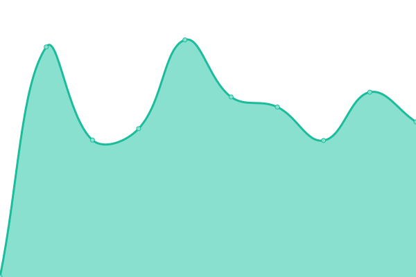
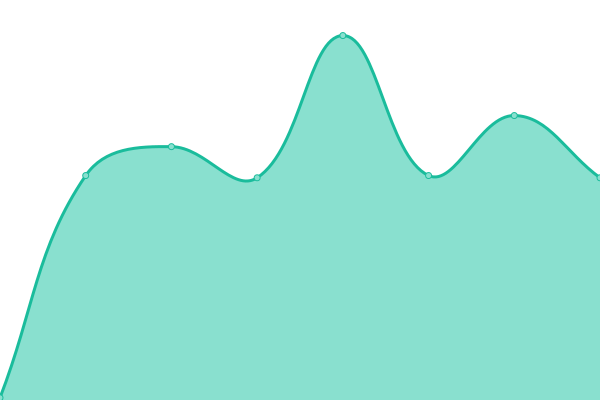
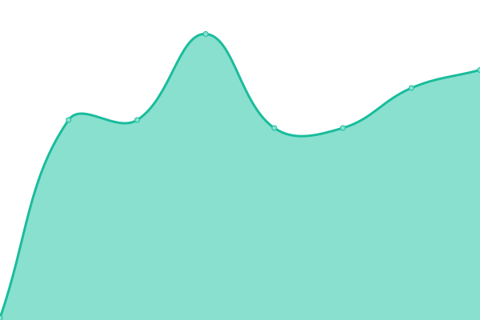

# [📈 Live Status](https://acidflash.github.io/upptime): <!--live status--> **🟩 All systems operational**

This repository contains the open-source uptime monitor and status page for [Jonas Byström](https://acidflash.github.io/upptime), powered by [Upptime](https://github.com/upptime/upptime).

With [Upptime](https://upptime.js.org), you can get your own unlimited and free uptime monitor and status page, powered entirely by a GitHub repository. We use [Issues](https://github.com/acidflash/upptime/issues) as incident reports, [Actions](https://github.com/acidflash/upptime/actions) as uptime monitors, and [Pages](https://acidflash.github.io/upptime) for the status page.

<!--start: status pages-->
<!-- This summary is generated by Upptime (https://github.com/upptime/upptime) -->
<!-- Do not edit this manually, your changes will be overwritten -->
<!-- prettier-ignore -->
| URL | Status | History | Response Time | Uptime |
| --- | ------ | ------- | ------------- | ------ |
|  [Connect.ax](https://www.connect.ax) | 🟩 Up | [connect-ax.yml](https://github.com/acidflash/upptime/commits/HEAD/history/connect-ax.yml) | 

 1565ms
     
 | 

<a href="https://acidflash.github.io/upptime/history/connect-ax">100.00%</a>
    

|  [Webmail](https://webmail.ipconnect.fi) | 🟩 Up | [webmail.yml](https://github.com/acidflash/upptime/commits/HEAD/history/webmail.yml) | 

 1213ms
     
 | 

<a href="https://acidflash.github.io/upptime/history/webmail">100.00%</a>
    

|  [Webhost](https://webhost.connect.ax:8080) | 🟩 Up | [webhost.yml](https://github.com/acidflash/upptime/commits/HEAD/history/webhost.yml) | 

 944ms
     
 | 

<a href="https://acidflash.github.io/upptime/history/webhost">100.00%</a>
    

|  [dns.connect.ax](dns.connect.ax) | 🟩 Up | [dns-connect-ax.yml](https://github.com/acidflash/upptime/commits/HEAD/history/dns-connect-ax.yml) | 

 128ms
     
 | 

<a href="https://acidflash.github.io/upptime/history/dns-connect-ax">100.00%</a>
    

|  [dns2.ipconnect.fi](dns2.ipconnect.fi) | 🟩 Up | [dns2-ipconnect-fi.yml](https://github.com/acidflash/upptime/commits/HEAD/history/dns2-ipconnect-fi.yml) | 

 129ms
     
 | 

<a href="https://acidflash.github.io/upptime/history/dns2-ipconnect-fi">100.00%</a>
    

|  [dns3.ipconnect.fi](dns3.ipconnect.fi) | 🟩 Up | [dns3-ipconnect-fi.yml](https://github.com/acidflash/upptime/commits/HEAD/history/dns3-ipconnect-fi.yml) | 

 127ms
     
 | 

<a href="https://acidflash.github.io/upptime/history/dns3-ipconnect-fi">100.00%</a>
    

|  [dns4.ipconnect.fi](dns4.ipconnect.fi) | 🟩 Up | [dns4-ipconnect-fi.yml](https://github.com/acidflash/upptime/commits/HEAD/history/dns4-ipconnect-fi.yml) | 

 127ms
     
 | 

<a href="https://acidflash.github.io/upptime/history/dns4-ipconnect-fi">100.00%</a>
    

|  [smtp3.ipconnect.fi](smtp3.ipconnect.fi) | 🟩 Up | [smtp3-ipconnect-fi.yml](https://github.com/acidflash/upptime/commits/HEAD/history/smtp3-ipconnect-fi.yml) | 

 128ms
     
 | 

<a href="https://acidflash.github.io/upptime/history/smtp3-ipconnect-fi">100.00%</a>
    

|  [smtp10.ipconnect.fi](smtp10.ipconnect.fi) | 🟩 Up | [smtp10-ipconnect-fi.yml](https://github.com/acidflash/upptime/commits/HEAD/history/smtp10-ipconnect-fi.yml) | 

 128ms
     
 | 

<a href="https://acidflash.github.io/upptime/history/smtp10-ipconnect-fi">100.00%</a>
    

|  [smtp11.ipconnect.fi](smtp11.ipconnect.fi) | 🟩 Up | [smtp11-ipconnect-fi.yml](https://github.com/acidflash/upptime/commits/HEAD/history/smtp11-ipconnect-fi.yml) | 

 128ms
     
 | 

<a href="https://acidflash.github.io/upptime/history/smtp11-ipconnect-fi">100.00%</a>
    

|  [smtp12.ipconnect.fi](smtp12.ipconnect.fi) | 🟩 Up | [smtp12-ipconnect-fi.yml](https://github.com/acidflash/upptime/commits/HEAD/history/smtp12-ipconnect-fi.yml) | 

 128ms
     
 | 

<a href="https://acidflash.github.io/upptime/history/smtp12-ipconnect-fi">100.00%</a>
    

<!--end: status pages-->

[**Visit our status website →**](https://acidflash.github.io/upptime)

## 📄 License

- Powered by: [Upptime](https://github.com/upptime/upptime)
- Code: [MIT](./LICENSE) © [Anand Chowdhary](https://anandchowdhary.com), supported by [Pabio](https://pabio.com)
- Data in the `./history` directory: [Open Database License](https://opendatacommons.org/licenses/odbl/1-0/)
